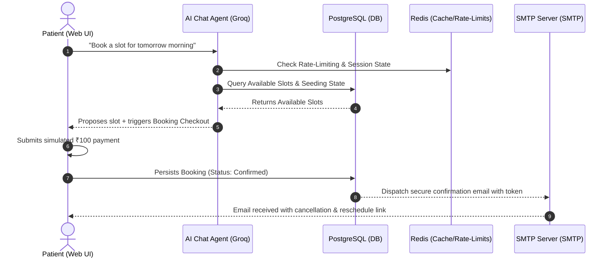

# MKura 🩺 — Multi-Agent AI Healthcare Scheduling Platform

**MKura** is an enterprise-grade, conversation-driven healthcare scheduling platform designed to automate patient booking lifecycles, waitlist optimizations, and doctor-side operations. By leveraging a **Multi-Agent AI architecture** powered by high-frequency LLMs, the platform removes administrative friction, eliminates empty booking slots, and provides a premium patient-centric care portal.

---

## 🚀 Architectural & Engineering Highlights

This project is built using modern software engineering patterns designed for high throughput, low latency, and robust state consistency:

### 1. Autonomous Multi-Agent AI Orchestration
*   **Booking Agent**: A conversation-driven assistant utilizing the sub-second **Groq API (Llama 3)**. Instead of traditional static web forms, it uses structured natural language processing (**Intent Classifier + Entity Extractor**) to organically extract patient metadata (name, email, phone) and recommend the earliest available appointment slots.
*   **Upgradation Agent**: An asynchronous state coordinator running a **First-In-First-Out (FIFO) waitlist queue**. When a booking is cancelled, it holds the slot, locks it from general availability, and extends a 15-minute priority upgrade offer via a secure, tokenized link to the next patient in line. If ignored or rejected, it automatically cascades the offer to subsequent candidates.

### 2. Event-Driven Doctor Operations
*   **Emergency Slot Blocking**: If a doctor experiences an emergency and blocks a slot, the system automatically triggers an event-driven rescheduling pipeline. Impacted patients are notified immediately with customizable rescheduling actions, keeping clinical calendars fluid without administrative overhead.
*   **Real-time Calendar Board**: A 7-day responsive grid visualization showing patient status, slot states (available, booked, waitlisted, blocked), and automatic day-to-day schedule rolling.

### 3. Sleek Transient State & Concurrency Control
*   **Simulated Demo Payment Lifecycle**: Replaced heavy external SDK dependencies with a modular, lightweight simulated checkout drawer. The checkout processes a ₹100 deposit with realistic transitions, and securely resumes the booking chat session on completion.
*   **Concurreny & Booking Safeguards**: Implements a strict **1-hour minimum lead-time constraint** to prevent short-notice doctor disruptions. Automatically enforces hard boundaries by filtering out past-date slots and expired same-day times across all endpoints.

---

## 📊 System Architecture & Data Flow



---

## 🛠️ Advanced Tech Stack & Rationale

| Layer | Technology | Engineering Rationale |
| :--- | :--- | :--- |
| **Frontend Framework** | `React 18` + `TypeScript` + `Vite` | Fast bundler speeds, strict type-safety across components, and optimized production asset compiling. |
| **Styling & UI** | `Tailwind CSS` + `Framer Motion` | Modern glassmorphism themes, customized HSL color palette, and physics-based micro-animations for premium visual feedback. |
| **Backend API** | `FastAPI (Python 3.11)` | Asynchronous ASGI framework providing native dependency injection, automatic Pydantic validation, and high-performance throughput. |
| **Database ORM** | `PostgreSQL 15` + `SQLAlchemy (Asyncio)` | Robust relational storage with asynchronous engine execution, ensuring non-blocking PostgreSQL connection pooling. |
| **Cache & Middleware** | `Redis 7` | Ultra-fast key-value store handling low-latency API rate-limiting and session synchronization. |
| **Generative AI** | `Groq SDK (Llama 3 70B)` | Sub-second inference latency, allowing natural conversational flows and seamless token extraction. |
| **Asynchronous Mailer** | `aiosmtplib` | Modern SMTP client ensuring notification dispatches don't block main threat event loops. |

---

## 📂 Clean & Scalable Directory Structure

The repository is divided into a decoupled, high-cohesion monorepo design, separating frontend visual states from backend domain logic:

```
Multi-agent-clinic-scheduler/
├── backend/                         # FastAPI Application Service
│   ├── app/
│   │   ├── api/                     # REST API Controllers & Dependecies
│   │   │   ├── routes/              # Auth, Bookings, Slots, and Chat router endpoints
│   │   │   └── deps.py              # Auth middleware & Database session injectors
│   │   ├── agents/                  # Intelligent AI Agents layer
│   │   │   ├── nlp/                 # Entity Extractor & Intent Classifier services
│   │   │   ├── booking_agent.py     # Dialogue state and scheduling AI agent
│   │   │   └── upgradation_agent.py # Queue parser and FIFO waitlist scheduler
│   │   ├── core/                    # App configurations, secrets, and Redis rate limiters
│   │   ├── models/                  # Database relational models (Doctor, Slot, Booking, Waitlist)
│   │   ├── schemas/                 # Strongly-typed input/output Pydantic structures
│   │   ├── services/                # Asynchronous helper services (SMTP, Slot seeder)
│   │   └── main.py                  # Lifespan initializer and CORS configurations
│   ├── requirements.txt             # Python backend dependencies manifest
│   └── seed_data.py                 # Seeds clinic calendar and default Doctor accounts
├── frontend/                        # React Frontend Application
│   ├── src/
│   │   ├── components/              # Modular shared UI assets
│   │   │   └── ChatAgent/           # Frosted glass AI chat agent overlay and Payment drawer
│   │   ├── pages/                   # Main Page Views
│   │   │   ├── Landing.tsx          # Premium landing page featuring coverflow carousel and chat modal trigger
│   │   │   ├── DoctorLogin.tsx      # Multi-factor-styled Doctor credential page
│   │   │   ├── DoctorDashboard.tsx  # Interactive 7-day doctor grid with slot-blocking action
│   │   │   └── Cancellation.tsx     # Direct, tokenized client cancellation portal
│   │   ├── services/                # Axios-configured API clients
│   │   ├── index.css                # Custom global utility tokens and fonts
│   │   └── App.tsx                  # Client router configurations
│   └── package.json                 # Frontend dependencies and bundler configurations
├── docker-compose.yml               # Production-like multi-container orchestrator
└── README.md                        # Project documentation
```

---

## 📈 Clinic Business Rules & Thresholds

| Standard Rule | Set Value | Purpose |
| :--- | :--- | :--- |
| **Clinic Operating Hours** | `9:00 AM - 6:00 PM` | Defines clinic scheduling boundary windows. |
| **Default Appointment Duration**| `20 Minutes` | Maximum length allocated per patient booking. |
| **Minimum Booking Lead Time** | `1 Hour` | Enforces clinical buffer windows (prevents immediate walk-ins). |
| **Same-Day Slot Booking Cutoff** | `5:00 PM` | Prevents late-afternoon bookings from scheduling on the same day. |
| **Waitlist Upgrade Hold Timer** | `15 Minutes` | The amount of time a waitlisted patient has to claim an upgrade. |
| **Simulated Payment Amount** | `₹100` | Refundable booking token used in the demo mode modal. |

---

## 🩺 Demo & Doctor Portal Seeding

To explore the doctor dashboard, the system includes an automated seeding process on backend startup:

*   **Configurable Doctor Portal Account**: By default, the database automatically seeds the doctor login with the email `mousam1234@mkhealth.com` and password `doctor123`.
*   **Custom Seeding Credentials**: You can easily customize or secure these default credentials by setting the `SEED_DOCTOR_EMAIL` and `SEED_DOCTOR_PASSWORD` environment variables in your backend service (e.g. Render).
*   **Simulated Checkout**: When prompted inside the chat modal, click the **"Pay ₹100"** button. The simulator handles state transactions and automatically redirects your active conversation.

---

## 📡 REST API Reference

### 🔐 Authentication & Accounts
*   `POST /api/auth/login` — Doctor credential verification & JWT token dispatch.

### 💬 Conversational AI Engine
*   `POST /api/chat/message` — Feeds natural text into the Groq Llama-3 parser to capture intents.
*   `GET /api/chat/slots/earliest` — Extracts the next earliest operational appointment slot.

### 📅 Slots Operations
*   `GET /api/slots/available` — Returns clinical slots for the rolling 7-day dashboard.
*   `POST /api/slots/block` — Enforces an emergency calendar hold and triggers automated rescheduling cascades.

### 🧾 Booking Lifecycle
*   `POST /api/bookings/create` — Validates transience, accepts checkout details, and confirms booking.
*   `GET /api/bookings/{id}/cancel/{token}` — Validates email-tokenized cancellation requests.
*   `POST /api/bookings/{id}/cancel/{token}` — Commits the cancellation request, prompting the FIFO upgradation flow.
*   `GET /api/bookings/doctor/all` — Queries all active bookings for authorized doctors.

---

## ⚖️ License
Distributed under the **MIT License**. Feel free to use this system to showcase multi-agent orchestration, clean coding architectures, or modern responsive web interfaces in your portfolios!